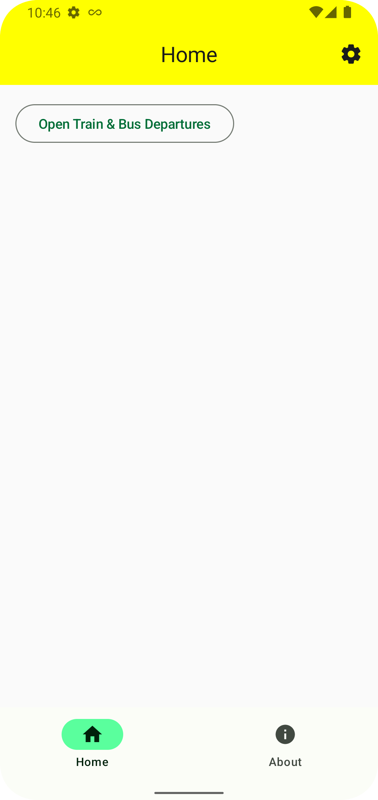

# Welcome !

This is a template project for creating Android application using Compose, Coroutines, Retrofit& Dagger Hilt in a multi-module setup.

## Showcase feature
This sample application is made of an home screen with two tabs and a button to show the train & bus departures from a specific train station & bus stop in London (UK) using the [TransportAPI](https://developer.transportapi.com/). For obvious reasons, key & app_id are not part of the project so if you want to run the project you would need to add those two keys in the `local.properties` file:
```
    
transportapi_app_key=<value>
transportapi_app_id=<value>
    
```

<p float="center">
    
     
</p>

The idea of the train & bus departure feature is to be used as a full screen display on a standing phone to inform about the next departures of the nearby station & bus stop. 
The API comes with 30 free api requests a day so instead of having some form of automatic refresh, it will just react on touching the screen instead. 

## Technical integration
### Detekt
[Detekt](https://detekt.github.io/detekt/) is a static code analysis tool for the Kotlin programming language. 

There are many different ways to run Detekt, this project is configured to use a single custom command for all code across modules. The setup is defined in the main `build.gradle.kts`.

There are two commands available: 

- `detektAll` that runs all checks.
- `detektAllBaseline` to ignore violations in the baseline, please use this carefully. 

The baseline is located at `config/detekt/baseline.xml`, a better alternative is to use `@Suppress("")` in code directly so that ignored violations are visible when browsing the code.

The `detektAll` is part of the the `pre-push` script for Git, so that violations can't be pushed.

Detekt is highly configurable but at the moment the config file `config/detekt/detekt.yml` is a plain copy of the default one.

The current configuration with just two commands is very simple and fast but does have the drawback that the actual `./gradlew detekt` command doesn't do anything as it's configured at the top level of the project instead for each subprojects. Therefore, on CI machine we should remember to use the `detektAll` command instead.

The formatting plugin is also enabled, which under the hood uses `Ktlint`. One caveats is that formatting issues can only be suppressed on file level `@file:Suppress(“detekt.rule”)`.§